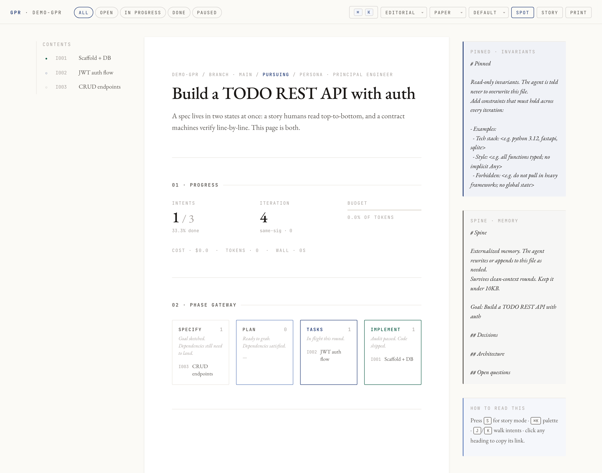
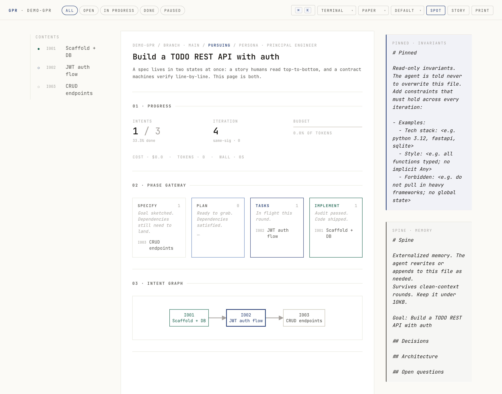
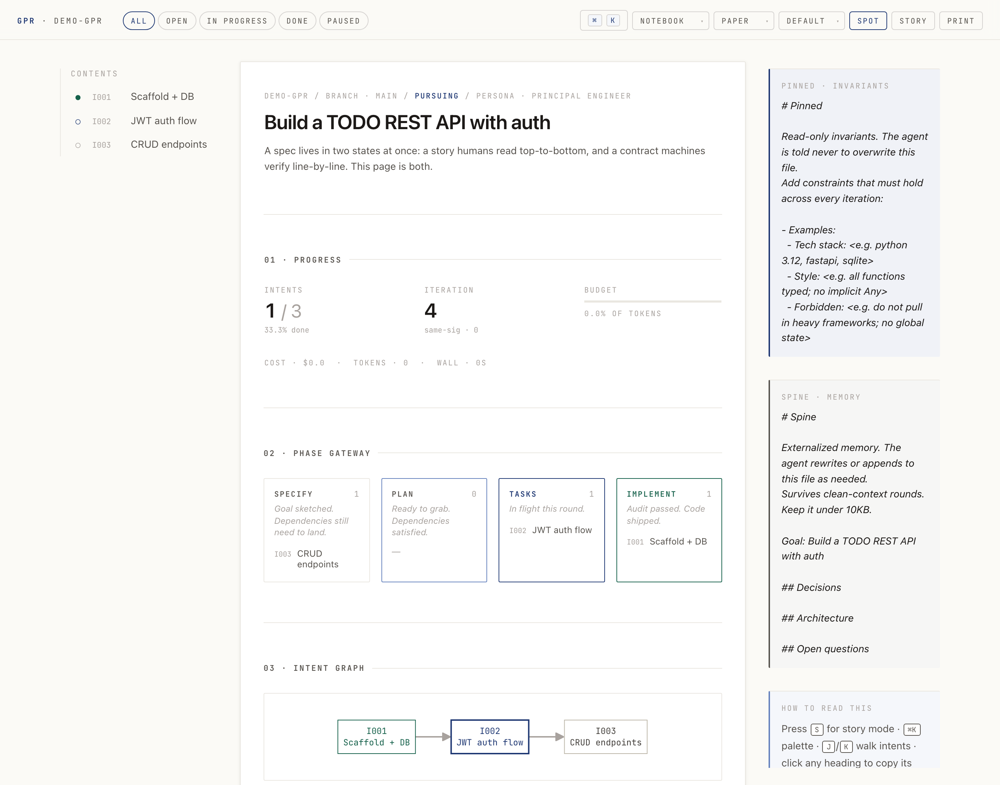
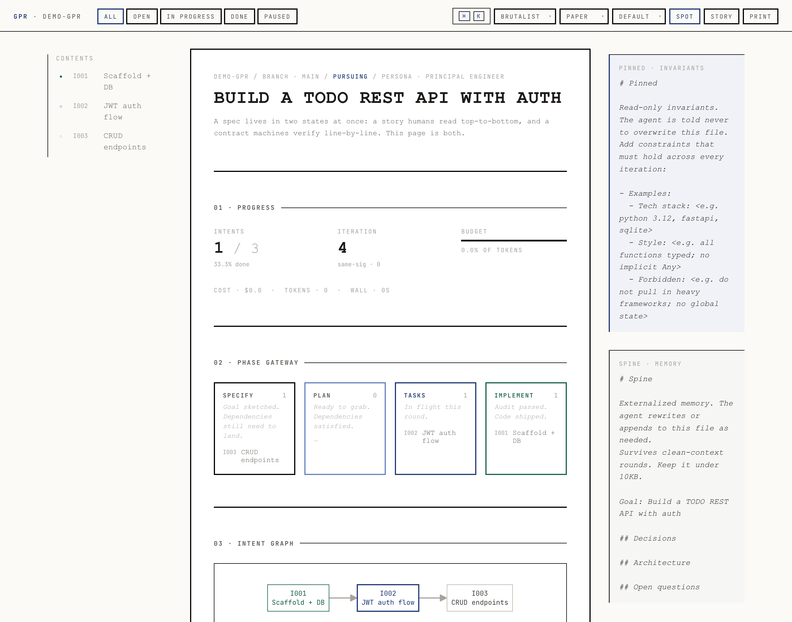

<div align="center">

# gpr

A CLI that drives a coding agent through an audit-verified Plan.

[](LICENSE)
[](tests/)
[](CHANGELOG.md)
[](pyproject.toml)
[](https://ko-fi.com/adityavg13)


</div>

What test-driven development is to code, gpr is to LLM coding agents: every claim of completion has to pass a real check before the loop accepts it.

---

## Quickstart

```bash
git clone https://github.com/AdityaVG13/GPR ~/.local/share/gpr
ln -sf ~/.local/share/gpr/bin/gpr ~/.local/bin/gpr
~/.local/share/gpr/install/install.sh             # registers /gpr Claude Code skill
gpr init --objective "Build a TODO REST API with auth"
gpr run --agent claude --max-cost-usd 5
```

<details>
<summary>Platform-specific install (macOS / Linux / Windows)</summary>

**macOS** — works as shown above. `brew install jq` if missing.

**Linux** — works as shown. `apt install jq` / `dnf install jq` / `pacman -S jq` if missing.

**Windows** — three paths:

1. **WSL** (recommended). Inside `wsl`, follow the Linux steps. `claude` CLI runs inside WSL and uses your subscription session normally.
2. **Git Bash** (MinGW). The same shell commands work; `~/.local/share/gpr` resolves under your Windows user profile. Install [Git for Windows](https://git-scm.com/download/win) for bash + jq, then run the quickstart in Git Bash.
3. **Native PowerShell / cmd** is not supported. Use WSL or Git Bash.

Desktop notifications use `osascript` on macOS, `notify-send` on Linux, and `powershell.exe` toast on Windows / WSL. Set `GPR_NO_NOTIFY=1` to disable.

</details>

Or, if you're already in a Claude Code TUI session inside a project:

```
/gpr Build a TODO REST API with auth
```

That bootstraps the Plan via an interactive interview (`gpr-grill`), runs the loop one iteration at a time, and yields back to you between rounds. Type `/gpr` again to advance, `/gpr-steer ...` to redirect.

> **Auth.** gpr never handles credentials. It spawns whichever agent CLI you point it at (`claude`, `codex`, `opencode`, `gemini`) as a subprocess; that CLI uses its own auth. So `claude` running on your Claude Code subscription session works exactly as well as one configured with `ANTHROPIC_API_KEY`.

---

## What you write

Every gpr run starts from a `Plan.json` — a real spec the loop reads on every iteration. Here's a real one (the example shipped under `examples/hello-fastapi/`):

```json
{
  "goal": "Build a FastAPI hello-world with a passing pytest suite.",
  "qualityGates": [
    {"name": "tests-pass", "cmd": "pytest -q", "required": true}
  ],
  "budget": {"tokens": 500000, "wallClockSeconds": 1800, "maxCostUsd": 2.0},
  "intents": [
    {
      "id": "I001",
      "title": "GET /hello returning {message: hello}",
      "dependsOn": [],
      "checks": [
        {
          "id": "C1",
          "description": "endpoint returns the expected JSON shape",
          "verifyCmd": "python -c \"from fastapi.testclient import TestClient; from app.main import app; r = TestClient(app).get('/hello'); assert r.json()['message'] == 'hello'\""
        }
      ]
    }
  ]
}
```

The agent can't mark `I001` done by saying so. The loop runs the `verifyCmd`. If it returns 0, the intent flips done. If it returns non-zero, the intent reverts to open and the failure goes into the next iteration's prompt.

---

## Why this exists

The naive ralph loop (`while true: claude -p prompt.md`) has five well-known failure modes. gpr fixes each one structurally.

| Failure mode | What goes wrong | gpr's fix |
|---|---|---|
| Self-reported completion | Model says it's done; it isn't | Layer-1 `verifyCmd` per check + Layer-2 cross-model auditor |
| Context compaction | State lost as context grows past the window | Clean session per iteration; memory externalised in `Spine.md` |
| Silent hangs | Agent CLI freezes; loop blocks | Per-iteration wall-clock timeout with retry and exponential backoff |
| No-op iterations | Prose with no real changes | Two-layer detector: zero meaningful tool calls + payload-hash + checkbox stalemate |
| Lost human control | Need to kill and restart to redirect | `Steer.md` interrupt file the agent reads first every round |

There's also a budget governor (token + wall-clock + USD with soft-stop wrap-up), a spec-drift sweep that re-runs old verifyCmds against the current state, and a `RESCOPE` signal for when the agent decides the plan itself is wrong.

---

## Commands

| Command | What it does |
|---|---|
| `gpr init` | Scaffold `.gpr/Plan.json`, `Pinned.md`, `Spine.md` |
| `gpr run` | Drive the loop until done / blocked / budget |
| `gpr status` | Show plan progress, next intent, budget burn |
| `gpr render` | Write a self-contained interactive HTML view of the Plan |
| `gpr steer` | Write a human interrupt to `Steer.md` |
| `gpr audit` | Re-run verifyCmds without looping |
| `gpr lint` | Warn about weak verifyCmds, dependency cycles, oversize fields |
| `gpr doctor` | Check Python, git, jq, and installed agent CLIs |
| `gpr config` | List / get / set viewer + run defaults |
| `gpr trace` | Tail recent events |
| `gpr commit-intent <ID>` | Generate a conventional-commits message for the iteration's diff |
| `gpr pr-description` | Synthesise the whole run into a PR body |
| `gpr confidence-audit` | Scrutinise the Plan for loopholes; loop until confident |

<p align="center">
  
</p>

---

## The interactive PRD viewer

`gpr render` writes a single self-contained HTML file. No build step, no server, opens via `file://`. Four styles, four themes, three font sizes — all toggleable from the toolbar or `gpr config`.

<table>
<tr>
<td width="50%"><br><sub><b>editorial</b> · serif body on warm paper, mono metadata in small caps</sub></td>
<td width="50%"><br><sub><b>terminal</b> · JetBrains Mono everywhere, hard borders, no shadows</sub></td>
</tr>
<tr>
<td width="50%"><br><sub><b>notebook</b> · clean Inter-style sans, tighter heading scale, dense</sub></td>
<td width="50%"><br><sub><b>brutalist</b> · system-mono, uppercase, thick borders, no transitions</sub></td>
</tr>
</table>

Themes (paper / sepia / dark / arctic) layer on top of any style, switching colors without changing the typography. Pick one combination, persist it via `gpr config set viewer.style notebook` and `gpr config set viewer.theme dark`.

What's in there:

- Sticky table of contents with live completion glyphs and scroll-progress fill
- URL-hash deep linking (`#intent-I003`)
- Filter chips and free-text search with localStorage persistence
- Keyboard navigation (`J`/`K` for intents, `/` to filter, `?` for shortcuts, `S` for story mode, `D` for diff overlay)
- Command palette (`⌘K`) indexing every section, intent, check, and toggle
- Click-to-zoom Mermaid intent graph with pan and zoom
- Phase Gateway (Specify / Plan / Tasks / Implement) derived from each intent's status + dependencies
- Acceptance criteria rendered Given / When / Then per check
- Decision log aggregating audit failures, reverse-audit, layer-2, and confidence-audit verdicts
- Per-intent reading-progress rings (turn off via `gpr config set viewer.rings false`)
- Optional rationale sidenotes when an intent or check has a `rationale` field
- Diff overlay against the latest snapshot (toolbar `diff` button or `D` key)
- Optional inline-edit mode that downloads a unified-diff patch (`gpr config set viewer.editable true`)
- Four styles (editorial / terminal / notebook / brutalist), four themes (paper / sepia / dark / arctic), three font sizes
- Print stylesheet that expands every section and breaks intents on page boundaries

To watch a run live:

```bash
gpr render --watch --auto-refresh 2
```

The viewer is a work in progress. Six concept demos for patterns we considered live in [`docs/examples/`](docs/examples/index.html) — per-intent rings, Tufte sidenotes, Tangle scrubbable metrics, Matuschak stacked columns, diff overlay, inline-edit patch export. If a pattern there matches a need or you've seen better, file an issue or send a PR.

---

## Two ways to invoke

| Mode | What it is | Best for |
|---|---|---|
| **CLI** (`gpr run`) | External process. gpr spawns the agent as a subprocess each round. | Autonomous overnight runs, headless servers, CI |
| **Claude skill** (`/gpr`) | One iteration runs inside your current Claude TUI session. | You're already in Claude and want to ratchet without leaving |

An MCP server (Mode C, accessible from Codex / Cursor / any MCP client) is on the roadmap once usage settles.

---

## The /gpr-grill flow

`/gpr` without an existing Plan activates **gpr-grill** — a cleanroom interactive interview that walks you through nine beats: persona, goal lock, success metric, tech stack, anti-goals, intent decomposition, per-intent checks, budget, and a confidence audit. One question per turn. Refuses hand-waving and weak `verifyCmd`s.

The confidence audit is the safety net. Before the loop runs, `gpr confidence-audit` invokes a scrutiniser agent that inspects the Plan for eight categories of loophole — goal coverage, DAG sanity, gameable verifyCmds, missing quality gates, Pinned-invariant contradictions, unrealistic budget, uncovered anti-goals, audit-cost vs work-cost. The interview loops until the auditor returns `confident: true` or you explicitly waive a remaining loophole into `.gpr/Pinned.md`.

---

## Compared to prior art

|  | snarktank/ralph | iannuttall/ralph | PageAI/ralph-loop | codex `/goal` | **gpr** |
|---|:-:|:-:|:-:|:-:|:-:|
| Verifiable completion | regex | regex | regex | self-audit | cross-model |
| Anti-spin guard | — | — | — | yes | yes |
| Compaction-immune | — | — | partial | yes | yes |
| Crash-resumable | partial | yes | partial | yes | yes |
| Human-in-loop | — | — | yes | — | yes |
| Budget-governed | — | — | — | yes | yes |
| Spec-drift sweep | — | — | — | — | yes |
| Multi-agent | partial | yes | yes | — | yes |
| Replay forensics | — | — | — | — | yes |

---

## Configuration

<details>
<summary>All config keys (defaults, scopes)</summary>

User-global config lives at `~/.config/gpr/config.json`. Per-project overrides at `.gpr/viewer-config.json`. Environment variables (`GPR_VIEWER_STYLE=...`) trump both.

| Key | Default | Notes |
|---|---|---|
| `viewer.style` | `editorial` | `editorial` / `terminal` / `notebook` / `brutalist` |
| `viewer.theme` | `paper` | `paper` / `sepia` / `dark` / `arctic` |
| `viewer.font_size` | `default` | `compact` / `default` / `large` |
| `viewer.spotlight` | `true` | radial-gradient spotlight cursor |
| `viewer.rings` | `true` | per-intent reading-progress rings |
| `viewer.sidenotes` | `true` | rationale sidenotes when fields are present |
| `viewer.scrubbable_budget` | `false` | reactive budget knobs (placeholder) |
| `viewer.editable` | `false` | contenteditable + patch download |
| `viewer.auto_refresh` | `0` | seconds between meta-refresh; `0` disables |
| `run.agent` | `claude` | `claude` / `codex` / `opencode` / `gemini` / `echo` |
| `run.deep_audit` | `false` | invoke Layer-2 cross-model auditor on done-flips |
| `run.audit_agent` | `null` | override agent for Layer-2 |
| `run.max_iters` | `50` | hard cap on iterations per run |

```bash
gpr config list
gpr config set viewer.style terminal
gpr config set viewer.editable true --scope project
gpr config unset viewer.style
gpr config reset
```

</details>

<details>
<summary>Plan.json schema</summary>

```json
{
  "schema_version": "1.1.0",
  "project": "string",
  "goal": "string",
  "branch": "string",
  "createdAt": "ISO timestamp",
  "status": "pursuing | paused | achieved | unmet_* | budget_limited | rescope_pending",
  "persona": {
    "primary": "principal_engineer | senior_architect | rapid_prototyper | research_partner",
    "rationale": "string"
  },
  "qualityGates": [{"name": "string", "cmd": "string", "required": true}],
  "budget": {"tokens": 5000000, "wallClockSeconds": 7200, "maxCostUsd": 25.0},
  "intents": [
    {
      "id": "I001",
      "title": "string",
      "status": "open | in_progress | done | paused",
      "priority": 10,
      "dependsOn": ["string"],
      "rationale": "string (optional, drives sidenote)",
      "checks": [
        {
          "id": "C1",
          "description": "string",
          "verifyCmd": "string (shell command)",
          "rationale": "string (optional)",
          "timeoutSeconds": 300,
          "retries": 3
        }
      ],
      "proofs": [],
      "auditFailures": []
    }
  ],
  "globalState": {"iteration": 0, "consecutiveSameSignature": 0, "wrapUpFlag": false}
}
```

</details>

<details>
<summary>Stop conditions and exit codes</summary>

| Exit | Status | Meaning |
|---:|---|---|
| 0 | `achieved` | All intents done, quality gates green, reverse audit clean |
| 2 | `blocked` | Agent emitted `blocked`; left for human |
| 3 | `decide` | Agent emitted `decide`; question written to `Steer.md` |
| 4 | `budget_limited` | Budget exhausted; final wrap-up turn ran |
| 5 | `unmet_zero_progress` | Two consecutive iterations with no meaningful tool calls |
| 6 | `unmet_stalemate` | Four iterations with no signature change |
| 7 | `rescope` | Agent proposed a plan rewrite; awaiting human review |
| 8 | `unmet_disk_full` | Less than 1GB free at iteration start |

</details>

<details>
<summary>Live updates while a run is going</summary>

Every iteration reads:

| File | Read each iter | Use |
|---|---|---|
| `Steer.md` | first thing | the right channel for live human steering |
| `Plan.json` | yes (fcntl-locked) | edit between iters; takes effect next round |
| `Pinned.md` | yes | applies next iter |
| `Spine.md` | yes (agent may overwrite) | edits respected but transient |
| `errors.log` | last 100 lines | applies next iter |

`Plan.html` is **not** read by the agent — it's a one-way render of state. To watch live:

```bash
gpr render --watch --auto-refresh 2
```

</details>

---

## Roadmap

v0.2 work, in priority order:

- **MCP server** (Phase 8). Long-running gpr daemon exposing `pick_intent`, `render_prompt`, `ingest_signal`, `audit`, `steer`, `status` as MCP tools. Any MCP client (Claude / Codex / Cursor) drives gpr without spawning a subprocess per call.
- **Audit pipeline hoist**. Single `lib/state/audit_pipeline.py` that owns the four audit flavours (Layer-1, Layer-2, reverse, confidence) and their flavour-vs-trigger mapping. Pairs with the MCP work since audit operations become MCP tools.
- **Worktree mode**. `gpr run --worktree` runs each iteration in a `git worktree` so failed iterations don't pollute the working tree. Auto-merge on success.
- **Confidence-audit auto-revise**. The loop currently surfaces loopholes for the human to apply manually. Auto-apply the proposed `fix:` strings to Plan.json under fcntl, re-run the audit, exit when confident or after N attempts.
- **Server mode for the HTML viewer**. `gpr serve` with Server-Sent Events for live updates and inline-edit endpoints (today's editable mode downloads a patch instead).
- **Layer-2 audit cost cap**. Auto-downgrade to Layer-1 with warning when audit cost exceeds 20% of build cost for an intent.

The interactive PRD viewer is also explicitly WIP — six concept demos under [`docs/examples/`](docs/examples/index.html) sketch patterns we considered but didn't ship in v0.1.x.

## Reference

- [SKILL.md](install/skill/SKILL.md) — exact instructions Claude follows for one iteration
- [DESIGN.md](DESIGN.md) — design rationale and credit to prior art
- [SECURITY.md](SECURITY.md) — threat model and accepted risks
- [CONTRIBUTING.md](CONTRIBUTING.md) — how to add an agent backend, write a check, propose a feature
- [CODE_OF_CONDUCT.md](CODE_OF_CONDUCT.md) — Contributor Covenant 2.1
- [CHANGELOG.md](CHANGELOG.md) — release notes
- [examples/hello-fastapi/](examples/hello-fastapi/) — three-intent worked example
- [docs/examples/](docs/examples/index.html) — six concept demos for the next viewer pass

---

## Credits

Two skills not in this repo gave gpr good ideas to bake into the loop:

- **[mattpocock/skills](https://github.com/mattpocock/skills)** (MIT). The `grill-with-docs` skill shaped how `gpr-grill` interviews the user beat by beat with refusal rules. The `tdd` and `improve-codebase-architecture` skills informed the test discipline and module shape in `lib/state/`.
- **[mdrxy/staged-pr](https://gist.github.com/mdrxy/7ed93ddeac5706bce0318e7c4b436efd)**. Source of the conventional-commits-with-scope discipline, the conceptual-bullets-not-by-file rule, the noise filter, and the explicit anti-pattern list. `gpr commit-intent` and `gpr pr-description` apply that discipline to gpr's own outputs.

Borrowed ideas are credited in [DESIGN.md](DESIGN.md) with specifics on what was kept, what was changed, and why.

---

## Support

Open source is a passion project. If gpr saves you a round of agent compute or an hour of debugging, a small tip keeps the next iteration coming.

<p>
  <a href="https://ko-fi.com/adityavg13"></a>
</p>

---

## Cleanroom statement

gpr was designed after surveying snarktank/ralph, iannuttall/ralph, PageAI-Pro/ralph-loop, mikeyobrien/ralph-orchestrator, francescoalemanno/dex, breezewish/CodexPotter, and the OpenAI codex `/goal` implementation. All concepts re-derived independently; no prompt text or source code was copied. Specific design ancestry is credited in [DESIGN.md](DESIGN.md).

## License

[Apache 2.0](LICENSE). Copyright 2026 Aditya and contributors.
