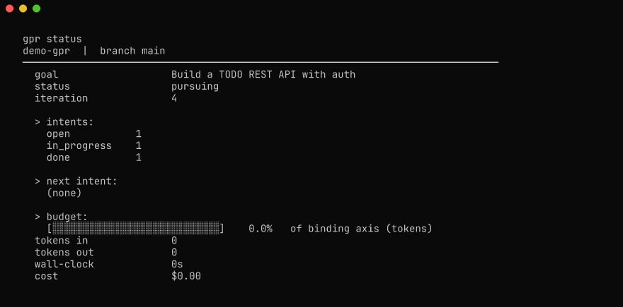
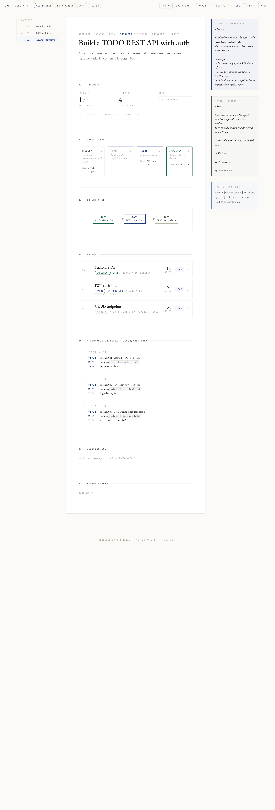

<div align="center">

# gpr

**Goal-driven PRD Ratchet** — an agent loop that only marks work done when real artifacts pass real checks.

[](LICENSE)
[](tests/)
[](CHANGELOG.md)
[](pyproject.toml)


</div>

---

## Install

```bash
git clone https://github.com/AdityaVG13/GPR ~/.local/share/gpr
ln -sf ~/.local/share/gpr/bin/gpr ~/.local/bin/gpr
~/.local/share/gpr/install/install.sh   # registers the /gpr Claude Code skill
gpr doctor
```

## Use

```bash
cd my-project
gpr init --objective "Build a TODO REST API with auth"
$EDITOR .gpr/Plan.json     # add intents and checks, or run /gpr-grill in a Claude session
gpr run --agent claude --max-cost-usd 5 --deep-audit
```

Or, from inside any Claude Code TUI session:

```
/gpr Build a TODO REST API with auth     # bootstraps via gpr-grill, runs first iteration
/gpr-status                              # progress + budget burn
/gpr-steer Switch from sqlite to postgres
```

## Why

The naive ralph loop (`while true: claude -p prompt.md`) has five well-known failure modes. gpr fixes each one structurally, not by hoping the model behaves.

| Failure mode | What goes wrong | gpr's fix |
|---|---|---|
| Self-reported completion | Model says it's done; it isn't | Layer-1 `verifyCmd` per check + Layer-2 cross-model auditor |
| Context compaction | State lost as context grows past the window | Clean session per iteration; memory externalised in `Spine.md` |
| Silent hangs | Agent CLI freezes; loop blocks | Per-iteration wall-clock timeout with retry and exponential backoff |
| No-op iterations | Prose with no real changes | Two-layer detector: zero meaningful tool calls + payload-hash + checkbox stalemate |
| Lost human control | Need to kill and restart to redirect | `Steer.md` interrupt file the agent reads first every round |

There's also a budget governor (token + wall-clock + USD with soft-stop wrap-up), a spec-drift sweep that re-runs old verifyCmds against the current state, and a `RESCOPE` signal for when the agent decides the plan itself is wrong.

## Status at a glance

<p align="center">
  
</p>

`gpr render` produces a self-contained HTML dashboard with the intent DAG (Mermaid), per-check evidence glyphs, and a rolling event log. The aesthetic borrows from [makingsoftware.com](https://makingsoftware.com): editorial serif body on a warm card, mono metadata in small-caps, hairline rules, cobalt accent. No build step — Tailwind and Mermaid via CDN.

<p align="center">
  
</p>

## How it works

### Concepts

| Term | Meaning |
|---|---|
| **Goal** | One sentence describing what success looks like. |
| **Intent** | A discrete unit of work toward the goal. Statuses: `open`, `in_progress`, `done`, `paused`. Intents declare `dependsOn` to form a DAG. |
| **Check** | An acceptance criterion attached to an intent, with a `verifyCmd` gpr runs to confirm it actually holds. |
| **Proof** | Recorded evidence that a check passed: command exit, file fingerprint, screenshot, manual sign-off. |
| **Signal** | Structured trailer block emitted by the agent each iteration. Tells gpr what happened. |
| **Spine.md** | Externalised memory; the agent rewrites it as decisions crystallise. |
| **Pinned.md** | Read-only invariants; the agent is told never to overwrite this file. |
| **Steer.md** | Human-editable interrupt; the agent reads it first every iteration. |

### One iteration

```
1. Read Steer.md         → if non-empty, do that work and clear it
2. Pick next intent      → continue an in-progress one if any; else priority + deps
3. Render the prompt     → goal in <untrusted_goal>, intent block, pinned, spine, errors, budget, signal grammar
4. Spawn the agent       → clean session, per-iter timeout, stream parsed for tokens
5. Parse the signal      → refuse to mark done without an explicit signal
6. Run audit             → Layer-1 verifyCmd; on fail, revert to open + log
7. (--deep-audit)        → Layer-2 cross-model verifier scrutinises done-flips
8. Update signature      → payload-hash + checkbox count for stalemate detector
9. Decide stop condition → achieved | blocked | decide | rescope | budget_limited | stalemate | zero_progress
```

When all intents flip done, gpr runs the **reverse audit** — a final spec-drift sweep that re-checks every closed intent and inspects the cumulative diff against the goal. It can refuse to declare `achieved` and reopen intents or recommend a rescope.

### Signal grammar

The agent emits exactly one block at the end of each iteration:

```
---gpr-signal---
{"status":"done","intent":"I001","checks_attempted":["C1","C2"],
 "memory":{"mode":"append","content":"Decided on JWT over sessions because ..."}}
---end---
```

`status` ∈ `{done, progress, blocked, decide, rescope}`. `done` only flips an intent if the audit passes — the agent cannot self-promote.

### Stop conditions

| Exit | Status | Meaning |
|---:|---|---|
| 0 | `achieved` | All intents done, quality gates green, reverse audit clean |
| 2 | `blocked` | Agent emitted `blocked`; left for human |
| 3 | `decide` | Agent emitted `decide`; question written to `Steer.md` |
| 4 | `budget_limited` | Budget exhausted; final wrap-up turn ran |
| 5 | `unmet_zero_progress` | Two consecutive iterations with no meaningful tool calls |
| 6 | `unmet_stalemate` | Four iterations with no signature change |
| 7 | `rescope` | Agent proposed a plan rewrite; awaiting human review |
| 8 | `unmet_disk_full` | Less than 1GB free at iteration start |

## Two ways to invoke

| Mode | What it is | Best for |
|---|---|---|
| **CLI** (`gpr run`) | External process. gpr spawns the agent as a subprocess each round. | Autonomous overnight runs, headless servers, CI. |
| **Claude skill** (`/gpr`) | One iteration runs inside your current Claude TUI session. The CLI is the canonical state machine; the skill borrows your active session as the worker. | Already in Claude and want to ratchet without leaving. |

An MCP server (Mode C) is on the roadmap once usage patterns settle.

## The /gpr-grill flow

If you start `/gpr` without an existing Plan, it activates **gpr-grill** — a cleanroom interactive spec interview that walks you through goal lock, success metric, tech stack, anti-goals, intent decomposition, per-intent checks, budget, and finally a **confidence audit**. Eight beats, one question per turn, refuses hand-waving and weak `verifyCmd`s.

The confidence audit is the safety net. Before the loop is allowed to run, `gpr confidence-audit` invokes a scrutiniser agent that inspects the Plan for eight categories of loophole — goal coverage, DAG sanity, gameable verifyCmds, missing quality gates, Pinned-invariant contradictions, unrealistic budget, uncovered anti-goals, audit-cost vs work-cost — and emits a structured verdict. The interview loops until the auditor returns `confident: true` or the user explicitly waives a remaining loophole into `.gpr/Pinned.md`. Output is a complete `.gpr/Plan.json` that has survived adversarial review.

## Compared to prior art

|  | snarktank/ralph | iannuttall/ralph | PageAI/ralph-loop | codex `/goal` | **gpr** |
|---|:-:|:-:|:-:|:-:|:-:|
| Verifiable completion | regex | regex | regex | self-audit | cross-model |
| Anti-spin guard | — | — | — | yes | yes |
| Compaction-immune | — | — | partial | yes | yes |
| Crash-resumable | partial | yes | partial | yes | yes |
| Human-in-loop | — | — | yes | — | yes |
| Budget-governed | — | — | — | yes | yes |
| Spec-drift sweep | — | — | — | — | yes |
| Multi-agent | partial | yes | yes | — | yes |
| Replay forensics | — | — | — | — | yes |

## Reference

- [SKILL.md](install/skill/SKILL.md) — what Claude does for one iteration
- [DESIGN.md](DESIGN.md) — design rationale and credit to prior art
- [CONTRIBUTING.md](CONTRIBUTING.md) — how to add an agent backend, write a check, or propose a feature
- [CHANGELOG.md](CHANGELOG.md) — release notes
- [examples/hello-fastapi/](examples/hello-fastapi/) — three-intent worked example

## Credits

Two skills not in this repo gave gpr good ideas to bake into the loop:

- **[mattpocock/skills](https://github.com/mattpocock/skills)** — Matt Pocock's small, composable engineering skills. The `grill-with-docs` skill in particular shaped how `gpr-grill` interviews the user beat by beat with refusal rules instead of running a one-shot template fill. The `tdd` and `improve-codebase-architecture` skills informed the test-discipline and module-shape choices in the `lib/state/` layer. MIT licensed; thank you Matt.
- **[mdrxy/staged-pr](https://gist.github.com/mdrxy/7ed93ddeac5706bce0318e7c4b436efd)** — the staged-pr skill is the source of the conventional-commits-with-scope discipline, the conceptual-bullets-not-by-file rule, the noise filter (skip lockfiles, generated code, dependency bumps), and the explicit anti-pattern list (no "this PR…", no "going forward", no "leverages" without specifics). `gpr commit-intent` and `gpr pr-description` apply that discipline to gpr's own outputs.

The visual aesthetic of `gpr render` borrows from **[makingsoftware.com](https://makingsoftware.com)** — editorial serif body, mono metadata in small caps, paper-edge shadow on a single white card, cobalt accent. CSS rewritten from cold; no styles copied.

All borrowed ideas are credited in [DESIGN.md](DESIGN.md) with specifics on what was kept, what was changed, and why.

## Cleanroom statement

gpr was designed after surveying snarktank/ralph, iannuttall/ralph, PageAI-Pro/ralph-loop, mikeyobrien/ralph-orchestrator, francescoalemanno/dex, breezewish/CodexPotter, and the OpenAI codex `/goal` implementation. All concepts re-derived independently; no prompt text or source code was copied. Specific design ancestry is credited in [DESIGN.md](DESIGN.md).

## License

[Apache 2.0](LICENSE). Copyright 2026 Aditya and contributors.
